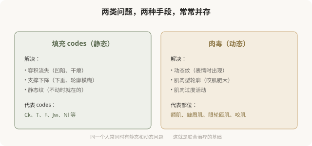
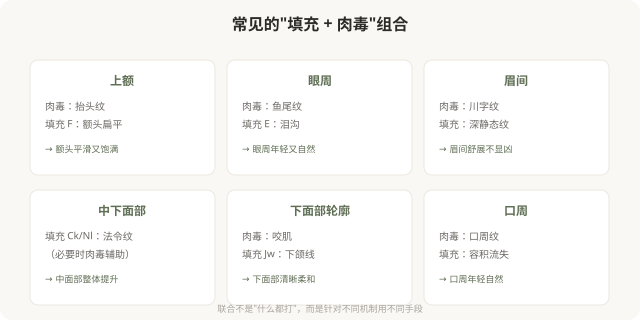

# 从 Codes 看联合治疗：填充与肉毒的协作

## 三个备选标题

1. 为什么打完填充还要配肉毒：codes 视角的联合治疗
2. 静态用填充、动态用肉毒：MD Codes 的联合思维
3. 注射不是“单打独斗”：codes 如何组合发力

## 封面介绍（100字以内）

MD Codes 的填充 codes 解决静态结构，肉毒解决动态肌肉问题，两者常常需要协作。理解联合思维，能明白为什么有些方案“既要填充又要肉毒”。

## 正文

先说结论：**MD Codes 的填充 codes 解决的是静态结构问题（容积、支撑、轮廓），而肉毒杆菌素解决的是动态肌肉问题（皱纹、肌肉型轮廓），两者常常需要协作才能达到整体自然的效果。**理解联合治疗的思维，能帮你明白为什么有些方案“既要填充又要肉毒”——不是想多卖项目，而是因为静态和动态问题往往同时存在，单一手段解决不了。

### 静态与动态：联合的逻辑

### 为什么往往需要联合

很多人老化是“静态 + 动态”问题叠加：

- **额头**：有抬头纹（动态，肉毒）+ 额头扁平（静态，F codes 填充）。
- **眼周**：有鱼尾纹（动态，肉毒）+ 泪沟（静态，E codes 填充）。
- **中面部**：法令纹（静态，Ck/Nl 填充）——但法令纹附近表情肌过度活动也可能加重。
- **下面部**：咬肌肥大（动态，肉毒）+ 下颌线模糊（静态，Jw codes 填充）。

**单一手段只解决一半问题。**比如只打填充不打肉毒，动态纹在笑的时候还会出现；只打肉毒不打填充，容积流失造成的凹陷改善不了。联合治疗针对不同机制，才能整体协调。

### 联合的几种典型组合

### 联合的节奏

联合治疗不是“一次性全部打完”，而是有节奏：

- **同期联合**：有些部位可以同次治疗进行（如额头肉毒 + 眼周填充）。
- **分次进行**：有些情况建议先做一类，观察效果后再做另一类。
- **优先级**：先解决最突出的问题，再看是否需要其他。

**好的医生会制定联合方案的节奏，而不是“今天把所有能打的都打掉”。**这也是避免过度治疗的重要原则。

### 联合 ≠ 过度

需要警惕的是：**联合治疗不等于“什么都打”。**有些人明明只有一个问题（比如只有鱼尾纹），却被推荐“全套联合方案”——这是过度治疗。

合理的联合基于“确实存在多种问题”，而不是“套餐更划算”。判断标准是：每个推荐的项目，是否都有明确的问题指向？如果没有，那它可能是销售而非医疗。

### 面诊时如何理解联合方案

当医生推荐联合方案时，你可以问：

- 我同时有哪些问题（静态 + 动态）？
- 每个项目针对的是哪个问题？
- 哪些是必须的，哪些是可选的？
- 节奏怎么安排？一次还是分次？
- 总剂量和累计费用大概多少？

**能逐项解释“为什么需要”的联合方案，比打包推荐的，更值得信任。**

### 一个认知

MD Codes 视角下的联合治疗，本质上是在说：**面部问题是多维的，单一手段往往不够。**理解这一点，能让你接受“既填充又肉毒”的合理性，也能识别“什么都打”的过度治疗——区别在于每个项目是否有明确的问题指向。

> 本文用于健康教育，不能替代面诊和个体化评估；具体联合方案须由具备资质的医师根据个体情况制定。

## 参考资料

- de Maio M. Combination treatments with MD Codes 相关学术发表（以原文为准）
- American Society of Plastic Surgeons: Combination facial rejuvenation
  https://www.plasticsurgery.org/cosmetic-procedures
