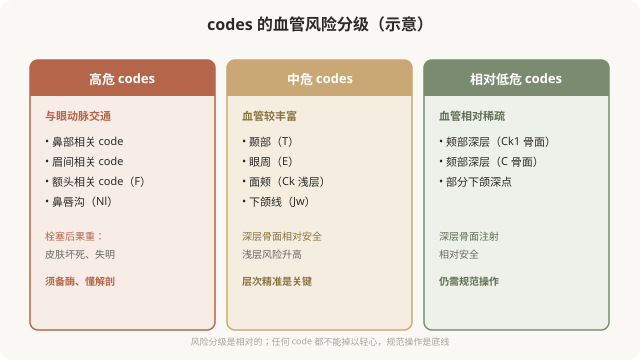

# MD Codes 与解剖安全：高危 codes 怎么打

## 三个备选标题

1. 有些 code 是“高危点”：MD Codes 的血管安全地图
2. 鼻部、眉间、额头：哪些 codes 风险最高
3. 编码注射的安全底线：每个 code 都有它的“危险血管”

## 封面介绍（100字以内）

MD Codes 的每个 code 都对应特定血管风险层次。鼻部、眉间、额头等高危 codes 与眼动脉交通，必须由熟悉解剖的医生在具备急救能力的机构操作。

## 正文

先说结论：**MD Codes 的价值之一，是把“每个 code 的血管风险”显性化——每个点位都有它对应的“危险血管”和相对安全的层次。**理解这一点，能让你明白为什么有些 code（如鼻部、眉间、额头相关）属于高危，必须由熟悉解剖的医生在具备急救能力的机构操作；也理解为什么 MD Codes 强调“深层骨面注射”——它往往是降低血管风险的关键。

### 每个 code 都有它的“血管档案”

### 高危 codes：与眼动脉交通的区域

最危险的一类 codes，是那些血管与眼动脉系统有交通的区域——因为材料一旦误入血管并逆流，可能堵塞视网膜中央动脉，造成失明。

- **鼻部相关 codes**：鼻背动脉等与眼动脉直接交通，是失明报告最多的区域。
- **眉间相关 codes**：同样与眼动脉系统交通。
- **额头 codes（F）**：眶上、滑车上血管走行。
- **鼻唇沟（Nl）**：面动脉及其分支，角动脉与内眦动脉交通。

**这些 codes 不是不能打，而是必须由熟悉解剖的医生、在具备急救能力（备透明质酸酶、能处理栓塞）的机构、在你充分知情的前提下打。**任何“高危 code 随便打、打完就走”的做法，都是对风险的漠视。

### 中危 codes：层次决定安全

中危 codes（如颞部、眼周、浅层面颊、下颌线）血管较丰富，但通过**深层骨面注射**可以显著降低风险。

- **颞部（T）**：浅层有颞浅静脉，深部骨面相对安全。
- **眼周（E）**：骨膜上深层支撑为主，浅层非常少量修饰。
- **下颌线（Jw）**：面动脉走行，深层骨面注射规避。

**这些 codes 的安全核心是“层次精准”——差几毫米，风险可能完全不同。**

### 低危不等于无风险

即使是相对低危的 codes（深层骨面支撑点），也不是“绝对安全”：

- 血管解剖有个体差异。
- 任何注射都有过敏、感染等通用风险。
- 操作不规范仍可能出问题。

**“低危”只是相对而言，规范操作始终是底线。**

### MD Codes 的安全逻辑：以深制险

MD Codes 强调“深层骨面注射”作为许多 codes 的推荐层次，背后的安全逻辑是：

### 消费者如何用“安全视角”参与

理解 codes 的风险分级后，你可以更主动地参与安全决策：

- **高危 code（鼻部、眉间等）格外审慎**：确认医生经验、机构备酶、知情到位。
- **询问层次**：医生能否讲清“这个 code 打在哪个层次、为什么”。
- **确认急救能力**：机构是否备有透明质酸酶、是否有栓塞处理流程。
- **理解“深层”的意义**：不追求“浅层无创”，因为深层往往更安全。

### 一个认知

MD Codes 的解剖安全维度告诉我们：**注射的安全，建立在“每个 code 都有它的血管地图”之上。**高危 codes 不是禁区，但必须用相应的谨慎和准备对待。理解这一点，你会把“机构是否备酶”“医生是否懂解剖”作为选择的标准，而不是只看价格和案例——这才是对风险应有的敬畏。

> 本文用于健康教育，不能替代面诊和个体化评估；高危 codes 的注射须由熟悉解剖的具备资质医师在备有急救能力的正规医疗机构开展。

## 参考资料

- de Maio M. MD Codes vascular safety 相关学术发表（以原文为准）
- American Society of Plastic Surgeons: Vascular occlusion & injectable safety
  https://www.plasticsurgery.org/patient-safety
