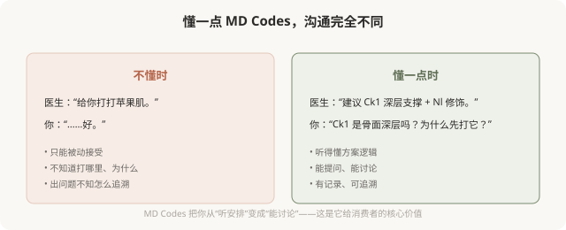
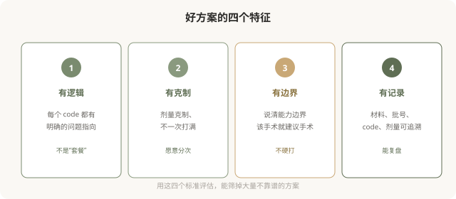

# 作为消费者如何理解 MD Codes：听懂、提问、参与

## 三个备选标题

1. 医生说“打 Ck1”是什么意思：消费者视角的 MD Codes
2. 用 MD Codes 和医生对话：一份参与指南
3. 从被动接受到主动参与：MD Codes 给消费者的工具

## 封面介绍（100字以内）

MD Codes 给了消费者一套和医生沟通的共同语言。学会听懂 code、提出对的问题、参与方案讨论，是 MD Codes 给你的最大价值。

## 正文

先说结论：**MD Codes 不仅是医生的工具，也是消费者的“共同语言”——它让你能听懂医生在说什么、提出对的问题、参与方案讨论，而不是只能点头。**这一篇是 MD Codes 专题的收尾，把前面 9 篇的内容整合成一份“消费者参与指南”：怎么听懂、怎么提问、怎么判断、怎么决策。理解这些，你就把 MD Codes 从“医生的专业术语”变成了“自己的决策工具”。

### 为什么消费者需要懂 MD Codes

### 听懂：code 背后在说什么

当医生用 code 描述方案时，它在传达几层信息：

- **部位**：Ck 是颊部、Nl 是鼻唇沟、Jw 是下颌线。
- **层次**：是否深层骨面、浅层修饰。
- **目标**：支撑、塑形、修饰、情感改善。
- **风险**：是否高危 code、主要血管在哪。

**你不需要记住每个 code 编号，但理解这个“翻译逻辑”，就能从一句话里读出很多信息。**

### 提问：面诊时该问什么

理解 MD Codes 后，面诊时你可以更具体地问：

**关于方案**：
- 您建议处理我的哪些 code？为什么是这些？
- 这些 code 的组合要实现什么目标（支撑？修饰？情感改善）？

**关于层次和技术**：
- Ck1 是深层骨面注射吗？用什么型号材料？
- 这些 code 用锐针还是钝针？为什么？

**关于风险**：
- 这些 code 里哪些是高危？主要血管在哪？
- 机构备有透明质酸酶吗？

**关于预期**：
- 这个方案预期能改善什么、改善到什么程度？
- 需要分次吗？节奏怎么安排？

**关于决策**：
- 有没有创伤更小的替代方案？
- 我这个年龄/基础，适合这样的方案吗？

**能正面回答这些问题的医生，比只说“放心，包你满意”的医生，更值得托付。**

### 判断：如何评估方案

理解 MD Codes 后，你可以用几个标准评估方案：

### 参与：建立自己的注射记录

理解 MD Codes 的另一个好处是：它让你的注射记录更结构化。每次治疗后，记录：

- **日期、医生、机构**。
- **处理的 code**（如 Ck1、Jw2、E1）。
- **材料、品牌、批号、每个 code 的剂量**。
- **层次和技术**（深层骨面？锐针还是钝针？）。
- **效果和反应**。

**这份记录的价值**：远期出问题能溯源、换医生时能让新医生了解历史、长期走向能复盘判断是否自然。MD Codes 让这种记录成为可能——因为有共同的“语言”。

### 几个常见误区

**误区一：背 code 显得专业。**不需要背编号。理解 code 背后的逻辑（部位、层次、目标、风险），比记住“Ck1 在哪”更有用。

**误区二：指定医生打某个 code。**你可以参与讨论，但具体方案应由医生根据你的解剖制定。强行指定“我要打 Ck1”，可能不是你真正需要的。

**误区三：把 MD Codes 当认证。**有些机构宣传“MD Codes 认证医生”作为卖点。了解医生是否受过相关培训是合理的，但更重要的是医生的整体资质、经验和沟通态度——而不是单一认证。

**误区四：认为打了 code 就一定好。**MD Codes 是方法论，但效果仍取决于医生的理解、你的解剖和合理预期。它提高的是下限，不是保证上限。

### 给 MD Codes 专题的读者

这 10 篇 MD Codes 专题，目的不是让你成为专家，而是给你一套**理解和参与的工具**：

- 听懂医生用 code 描述的方案。
- 提出对的问题，参与决策。
- 用四个标准评估方案好坏。
- 建立结构化的注射记录。
- 识别过度治疗和不靠谱方案。

**MD Codes 的核心启示是：好的注射有章可循、可以沟通、可以追溯。**作为消费者，掌握这种“共同语言”，你就从被动接受变成主动参与——这是任何一笔注射决策里，最有价值的升级。

### 一个收尾认知

回到这个系列的核心：**注射的艺术，是理解与克制的艺术。**MD Codes 把“理解”工具化了——它让面部结构、注射目标、风险层次都变得可以讨论。而“克制”则贯穿始终：好医生用最少的 code、最克制的剂量，达到最自然的效果。

理解 MD Codes，本质上是理解**注射为什么是一门需要章法、可以沟通、应该审慎的艺术**。带着这种理解去面诊、去决策、去评估，你已经比大多数消费者更接近注射的核心了。

> 本文用于健康教育，不能替代面诊和个体化评估；具体方案须由具备资质的医师根据个体情况制定。

## 参考资料

- de Maio M. MD Codes 相关学术发表与患者教育资料（以原文为准）
- American Society of Plastic Surgeons: Patient resources & consultation
  https://www.plasticsurgery.org/patient-safety
