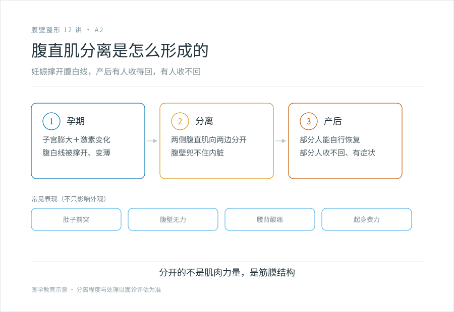
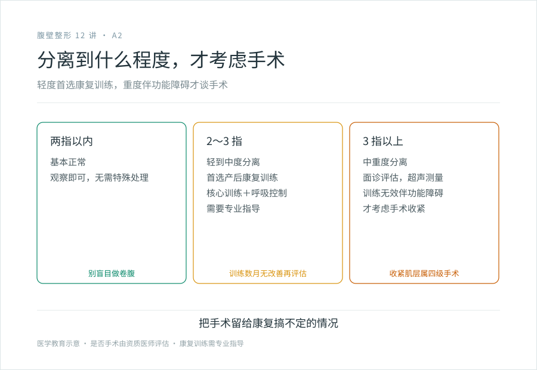

# 产后肚子回不去：是没瘦下来，还是腹直肌分开了

## 三个备选标题

1. 仰卧起坐收不回的肚子：产后腹直肌分离是怎么回事
2. 产后肚子鼓、没力气、腰酸，可能是肌肉层的问题
3. 腹直肌分离到什么程度，才需要手术

## 封面介绍（100 字以内）

产后腹直肌分离是腹白线被撑开没收回去，肚子鼓、无力、腰酸。轻度首选康复训练，重度伴功能障碍才考虑手术收紧肌层。它不是没努力，是结构问题。

## 分级标识

**手术分级：科普说明**（腹直肌分离判断；涉及手术收紧肌层属腹壁成形术范畴，为四级手术，以机构核准为准）

## 正文

先说结论：**产后肚子鼓鼓的、收不回去，常常不是脂肪，也不是没努力，而是腹直肌分开了。**妊娠中晚期，肚子前侧那条纵行的腹白线被撑开，两侧的腹直肌向两边分开。生完孩子，有的人能自己收回去，有的人收不回去。收不回去的那种，做再多卷腹也没用——因为分开的不是肌肉力量，是筋膜结构，运动救不了结构。

### 它是怎么形成的

腹白线是腹部正中一条结缔组织带，连接左右两侧的腹直肌。怀孕时子宫膨大，激素让结缔组织变松，腹白线被撑开、变薄，两侧腹直肌被推向两边。

这是妊娠的正常生理变化，大多数产妇产后会有不同程度的分离。问题在于：有的人产后能自行恢复，有的人不能。不能恢复的影响因素包括多次妊娠、多胎、羊水过多、胎儿大、产后过早负重、核心肌群基础差等。

### 腹直肌分离会带来什么

不只是“肚子不好看”。它是腹壁这一层结构兜不住内脏了，所以会有功能性的表现：

- **肚子前突、松弛**：站立时肚子鼓，尤其下腹，像还没生完。
- **腹壁无力**：做起身、仰卧起坐这类动作时没力气，感觉肚子“使不上劲”。
- **腰背痛**：腹壁核心肌群失效，腰椎稳定性下降，久站久坐容易腰酸。
- **消化和盆底的连带影响**：严重时可能伴随腹胀、便秘或盆底问题。

**判断要不要处理，不只看外观，更要看有没有这些功能障碍。**一个分离不小但毫无症状、能正常运动的人，和一个分离不算大但腰痛到没法抱孩子的人，处理思路不一样。

### 自己可以粗测一下

面诊前可以先做个抬肩测试：

仰卧，屈膝，稍微抬起头和肩（半个卷腹），用手指横着按在腹白线上，从肚脐上方到下方几个位置都摸一摸，感受两块腹直肌之间那条沟有多宽。

- 两指以内：基本正常。
- 两到三指：轻到中度分离。
- 三指以上或能明显按进去一个深坑：中到重度，建议面诊。

**注意**：自测只是给你一个参照，真正的判断要医生做体格检查，有时会配合超声测量分离的宽度和筋膜的情况。

### 哪种程度需要手术

这是最常被问的问题，答案不是看几指宽这一个数字，而是几个因素一起看：

- **分离的宽度**：明显宽于正常范围（通常说大于 2～3 厘米或 2～3 指），保守训练效果有限。
- **有无功能障碍**：腰背痛、腹壁无力、影响日常活动。
- **保守治疗无效**：经过规范的产后康复训练（通常数月）仍无改善。
- **是否合并皮肤松弛**：如果同时有皮肤过剩，手术收紧肌层 + 切皮可以一次解决。

**轻度分离首选康复训练。**产后康复的核心训练、电刺激、生物反馈等，对轻中度分离有效，且没有手术风险。先给身体自己恢复和训练的时间，把手术留给那些真正收不回去、并有明显功能障碍的情况。

手术收紧肌层（腹直肌前鞘折叠缝合）通常作为腹壁成形术的一部分进行，属于四级手术。**它不是“小修小补”，而是把撑开的筋膜结构重新缝紧。**

### 关于训练的几个实话

- **卷腹、仰卧起坐可能适得其反**。腹直肌分离期间，盲目做这类让腹压升高的动作，可能加重分离。产后训练应优先练深层核心（腹横肌）、呼吸控制和骨盆稳定，而不是猛练六块腹肌。
- **训练需要时间和专业指导**。几周一两个月看不出效果很正常，别拿“没效果”当“只能手术”的证据。
- **训练能改善多少有上限**。对筋膜已经严重松弛、分离很宽的情况，训练能把肌肉练强，但合不上结构性的缝隙。这时候手术才是对的工具。

### 一个常见的误解

“生完孩子肚子回不去是因为我懒。”——不是。如果你有明显的腹直肌分离，那是妊娠撑开了腹壁结构，和你有没有每天练腹肌没关系。别用意志力的尺子去量一个结构问题。同样，也别因为“别人产后都恢复了”就觉得自己一定也能——每个人的结缔组织弹性、妊娠情况、恢复条件都不同。

### 决策前想清楚

- 生育计划是否完成？还打算再孕的话，手术收紧的效果会被下一次妊娠抵消，建议生育计划完成后再做。
- 有没有认真做过一段时间的产后康复？手术是把康复搞不定的情况才交给手术，不是跳过康复。
- 是否同时有皮肤松弛？如果是，手术可以一并处理。

> 本文用于健康教育，不能替代面诊和产后康复评估；涉及手术收紧肌层的项目须在有相应资质的医疗机构开展。

## 参考资料

- American Society of Plastic Surgeons: Tummy tuck (abdominoplasty)
  https://www.plasticsurgery.org/cosmetic-procedures/tummy-tuck
- American Board of Cosmetic Surgery: Mini, Standard & Extended Tummy Tucks vs Body Lifts
  https://www.americanboardcosmeticsurgery.org/blog/mini-standard-extended-tummy-tuck-or-body-lift/
- 中华医学会妇产科学分会、整形外科学分会：产后康复与腹直肌分离相关共识（以现行版本为准）
  https://www.cma.org.cn/
