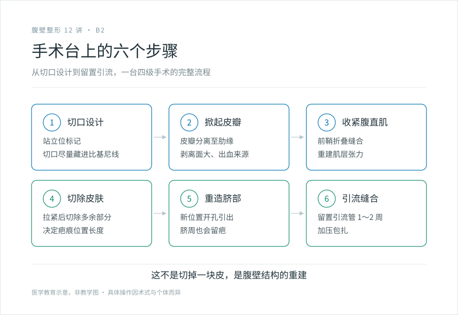
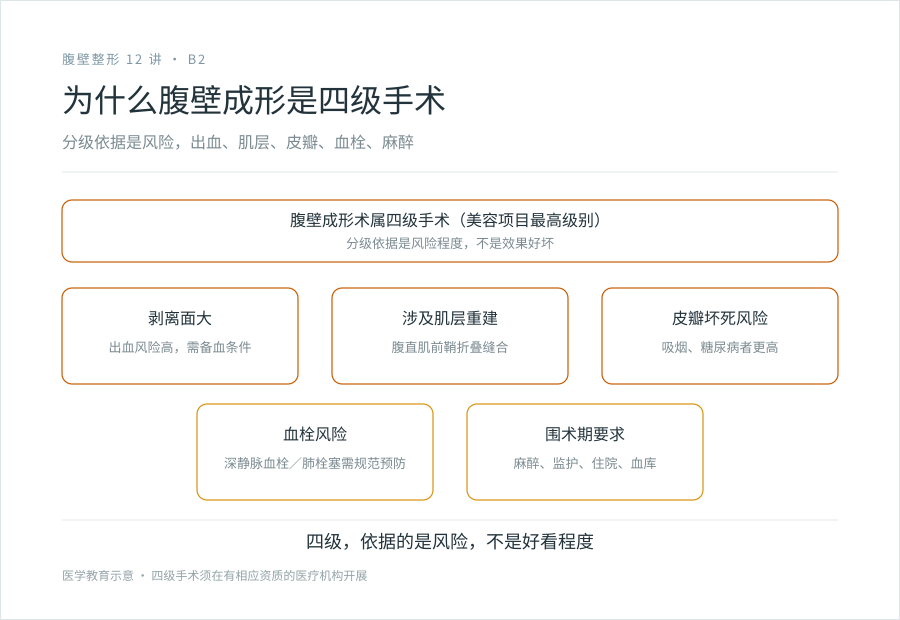

# 从切口到引流：腹壁成形手术台上到底做了什么

## 三个备选标题

1. 腹壁成形术的六个步骤：一台四级手术是怎么做的
2. 切皮、收紧、重造脐部：腹壁成形不是“切一刀”那么简单
3. 为什么腹壁成形是四级手术：看流程就知道

## 封面介绍（100 字以内）

腹壁成形术含切口设计、掀起皮瓣、收紧腹直肌、切除多余皮肤、重造脐部、留置引流六个主要步骤。在全身麻醉下进行，需住院、备血、术后监护。这是四级手术的复杂程度。

## 分级标识

**手术分级：四级**（腹壁成形术，含肌层收紧，以机构核准为准）

## 正文

先说结论：**腹壁成形术不是“把肚皮切掉一块缝上”，而是腹壁这一层结构的重新构建。**从切口设计到留置引流，中间要掀起大面积皮瓣、把分开的腹直肌缝拢、切掉多余的皮肤、把脐部重新安到新位置。它在全身麻醉下进行，要住院、要备血、要术后监护。看完这一篇你会明白，为什么这个手术被定为最高级别。

### 第一步：切口设计与标记

麻醉之前，医生会让你站立，用记号笔在腹部画出切口线和设计。**站立位标记是关键**——松弛的程度和方向，站着和躺着完全不一样，站着才能看清皮肤往下垂的真实情况。

切口的位置和长度由术式决定（见 B1）：迷你型在下腹做短切口，标准型从髋到髋，延伸型绕到侧腰，等等。医生会把切口尽量设计在比基尼线能遮住的范围内，但这取决于松弛程度，不是总能做到。

### 第二步：掀起皮瓣

切开皮肤和皮下脂肪后，把腹部的皮瓣（皮肤连着皮下脂肪这整层）从腹壁肌肉表面向上分离，一直掀到肋缘附近。

这一步暴露的剥离面很大，是这台手术出血、血清肿、皮瓣血供问题的根源。**剥离范围越大，潜在并发症越多**——这也是为什么腹壁成形风险随术式复杂度上升。

### 第三步：收紧腹直肌

掀开皮瓣后，能看到下面分开的腹直肌和松弛的腹白线。医生用缝线把分离的腹直肌前鞘折叠缝合，把撑开的肌肉层重新拢紧，像给腹壁系紧一条“内腰带”。

这一步是腹壁成形区别于单纯切皮的核心——**它重建的是肌肉筋膜层的张力，而不只是去掉皮肤。**产后腹直肌分离的功能改善，主要靠这一步。

收紧的张力不能过大也不能过小，过紧影响呼吸和活动，过松效果不持久。

### 第四步：切除多余皮肤

把掀起的皮瓣向下拉紧，多余的皮肤被标记、切除。切除的量因人而异，从一小条到一大块都有可能。

**这一步同时决定了疤痕的位置和长度。**切掉多少皮肤、切口设计在哪，直接决定你术后疤痕长什么样（见 C1）。脐部会被重新定位——原来的脐孔留在原位，皮瓣向下拉后，在新的位置开一个孔，把脐部引出来重新塑形。

### 第五步：重造脐部

标准型及以上的腹壁成形，脐部要重新做。原来的肚脐连在腹壁深部不动，皮瓣下移后，在新的合适位置开孔，把脐部引出来，缝合成新的脐孔形状。

脐周也会有疤痕。一个好看、自然、不突出的脐孔，是腹壁成形术后外观的关键细节之一，也是考验医生技术的地方。

### 第六步：留置引流、缝合、加压包扎

皮下剥离面大，术后会渗液，所以常规在皮下留置引流管（一根或数根），把积液引出来，等引流量减少到一定程度再拔除。逐层缝合，加压包扎。

术后你需要带引流管生活一段时间（通常 1～2 周，看引流量），这是恢复期最不方便的部分之一。

### 为什么这是四级手术

把上面六步合起来看，就明白为什么腹壁成形被定为最高级别：

- **剥离面大、出血风险高**：腹部皮瓣血供丰富，术中和术后可能明显出血，需要具备输血条件。
- **涉及肌层重建**：不只是体表操作，要动到腹壁的肌肉筋膜层。
- **皮瓣坏死风险**：皮瓣远端（尤其中央和下缘）血供受影响时可能部分坏死，吸烟、糖尿病者风险更高。
- **血栓风险**：腹部大手术 + 术后一段时间活动受限，深静脉血栓和肺栓塞是需要严肃对待的并发症。
- **麻醉与围术期要求高**：全身麻醉、住院、术后监护、血栓预防、必要的血库支持，这些不是普通门诊能提供的。

**四级手术的分级依据是风险，不是“好看程度”。**它对机构（床位、血库、ICU 或绿色通道、麻醉）、医生资质和抢救能力的要求最高。这也意味着，能把四级手术做规范的机构，背后是一整套团队和硬件，不只是主刀一个人。

### 麻醉和住院的现实

- 全身麻醉为主，少数情况下椎管内麻醉联合镇静。
- 需要住院，通常几天，看术式复杂度和恢复情况。
- 术后早期需要监测生命体征、引流量、皮瓣血供。
- 出院不等于恢复完成，回家还要继续带引流、限制活动、定期复查（见 C3）。

### 看懂这一篇之后

了解了流程，你就能理解：为什么医生说“这不是小手术”，为什么术后要那么久恢复，为什么疤痕和风险无法回避。带着这个理解去面诊，你能问出更具体的问题（见 D2），也能更现实地对待恢复期。

> 本文用于健康教育，不能替代面诊和个体化评估；腹壁成形术属四级手术，须在有相应资质（含麻醉、血库、住院、监护能力）的医疗机构开展。

## 参考资料

- American Society of Plastic Surgeons: Tummy tuck (abdominoplasty)
  https://www.plasticsurgery.org/cosmetic-procedures/tummy-tuck
- American Board of Cosmetic Surgery: Mini, Standard & Extended Tummy Tucks vs Body Lifts
  https://www.americanboardcosmeticsurgery.org/blog/mini-standard-extended-tummy-tuck-or-body-lift/
- 中华医学会整形外科学分会：腹壁成形术相关诊疗规范（以现行版本为准）
  https://www.cma.org.cn/
