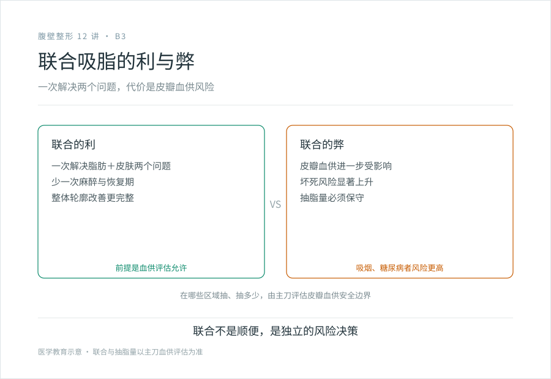

# 腹壁成形能和吸脂一起做吗：联合手术的合理性与边界

## 三个备选标题

1. 切皮加抽脂一次做完：联合手术值不值这个风险
2. 腹壁成形 + 吸脂：什么时候该一起做，什么时候该分开
3. “顺便抽个脂”不顺便：联合手术是独立的风险决策

## 封面介绍（100 字以内）

脂肪型加皮肤松弛的混合人群，腹壁成形联合吸脂能一次解决两个问题。但联合手术会影响皮瓣血供，增加坏死风险，需主刀评估安全边界。联合不是顺便，是独立决策。

## 分级标识

**手术分级：四级**（腹壁成形术；联合吸脂的级别以机构核准为准，复杂联合可达四级）

## 正文

先说结论：**腹壁成形和吸脂可以联合做，但“联合”不等于“顺便”。**对于脂肪和皮肤松弛同时存在的人，一次手术解决两个问题，少受一次恢复的罪，这是合理的。但联合手术不是免费午餐——在同一个区域既抽脂又切皮，会影响皮瓣的血液供应，增加皮瓣坏死的风险。所以要不要联合、在哪些区域联合、抽多少，是一个独立的风险决策，不是“反正都开了刀，顺手再抽点”。

### 为什么有人需要联合

腹壁的混合型问题很常见：

- 皮下脂肪堆积 + 皮肤松弛：肚子既有一层厚脂肪，皮也松了。
- 产后 + 局部脂肪：腹直肌分离、皮肤松弛，同时侧腰或上腹有顽固脂肪。
- 减重后 + 残留脂肪：皮肤过剩为主，但围裙肚里还混着脂肪。

**单纯做腹壁成形，只切皮收紧肌肉，不处理脂肪。**如果脂肪是次要矛盾，切完皮拉紧了，肚子就平了，不需要抽。但如果脂肪量不少，只切皮不抽脂，拉紧后肚子还是鼓的，效果打折。

这种情况下联合吸脂，先减少脂肪体积、再切除多余皮肤，一次解决两个层面的问题。

### 联合的风险：血供

这是这一篇最重要的一句话：**腹壁成形术本身就要把腹部皮瓣掀起来，皮瓣的血液供应已经被改变。如果再在皮瓣的同一区域大量抽脂，会进一步破坏皮瓣的微循环，皮瓣远端（下缘、中央）缺血坏死的风险显著上升。**

皮瓣坏死的后果是伤口愈合不良、皮肤发黑脱落、长期换药甚至二次手术。吸烟者、糖尿病者本来皮瓣血供就差，联合大量抽脂的风险更高。

所以联合吸脂不是“想抽多少抽多少”，主刀要评估：

- **在哪些区域抽是安全的**：通常皮瓣中央区是血供脆弱区，谨慎抽或回避；侧腰、上腹等相对安全的区域可以抽。
- **抽多少**：联合手术往往保守抽脂，保留足够的脂肪层保障血供，追求的是“安全地改善”，而不是“最大化抽吸”。
- **皮瓣的血供来源是否被破坏**：经验丰富的医生会根据皮瓣血供的解剖设计，避免在穿支血管区域过度抽吸。

### 什么时候该联合，什么时候该分期

没有一个统一答案，取决于脂肪量、皮肤松弛程度、皮瓣条件、术者经验和你的身体状况。大致的原则：

**倾向联合**：

- 脂肪和皮肤松弛都是主要矛盾，一次手术能解决两个问题。
- 主刀评估皮瓣血供允许、抽脂量在安全范围。
- 你希望只经历一次恢复期（但要承担联合手术的更高风险）。

**倾向分期**：

- 需要大量抽脂，联合会显著增加皮瓣坏死风险。
- 皮瓣血供条件不好（吸烟、糖尿病、既往腹部手术疤痕影响血供）。
- 主刀评估联合不安全，建议先抽脂、间隔一段时间后再做腹壁成形。
- 或反过来：先做腹壁成形解决皮肤肌肉，恢复后再补吸脂精修。

**分期的代价是两次手术、两次恢复，但每次的风险都更可控。**有时候“慢一点”比“一次搞定但风险翻倍”更值得。

### 关于“吸脂塑形”的预期

联合吸脂能改善的是局部脂肪体积和轮廓，不是“变成另外一个人的身材”。腹壁成形联合吸脂后，腹部更平、更紧、轮廓更顺，但：

- 不会大幅改变体重（吸出的脂肪体积有限）。
- 不会改变基础体质和易胖倾向。
- 体重管理还是要靠自己，不然剩余脂肪仍会增大。

### 几个常被问到的问题

- **“既然全麻了，能不能把大腿、胳膊也一起抽了？”**——能不能取决于手术总时长、总抽吸量、麻醉风险和你的身体耐受。把多个部位的大手术堆在一次全麻里，风险叠加，通常不建议。安全比分期多受一次罪重要。
- **“联合是不是比分开做便宜？”**——可能，因为省了一次麻醉、住院的基本成本。但联合手术的风险更高，这不是省钱该考虑的维度。费用的逻辑见 D3。
- **“医生说联合做没问题，是不是就可以放心？”**——医生评估可以联合，是说风险在可控范围，不是说没有风险。皮瓣坏死、血清肿、不对称这些并发症，联合手术里发生率更高，你需要知情并接受这个风险溢价。

### 决策前问清楚的

- 我的脂肪量需要联合吸脂吗，还是单纯切皮收紧就够？
- 如果联合，在哪些区域抽、大概抽多少？
- 联合会不会增加我这种情况的皮瓣坏死风险？
- 如果评估不适合联合，是先吸脂还是先做腹壁成形？

> 本文用于健康教育，不能替代面诊和个体化评估；腹壁成形术及联合吸脂属较高手术级别，须在有相应资质的医疗机构开展。

## 参考资料

- American Society of Plastic Surgeons: Tummy tuck (abdominoplasty) & Liposuction
  https://www.plasticsurgery.org/cosmetic-procedures/tummy-tuck
  https://www.plasticsurgery.org/cosmetic-procedures/liposuction
- American Board of Cosmetic Surgery: Mini, Standard & Extended Tummy Tucks vs Body Lifts
  https://www.americanboardcosmeticsurgery.org/blog/mini-standard-extended-tummy-tuck-or-body-lift/
- 中华医学会整形外科学分会：体形雕塑与腹壁成形相关资料（以现行版本为准）
  https://www.cma.org.cn/
