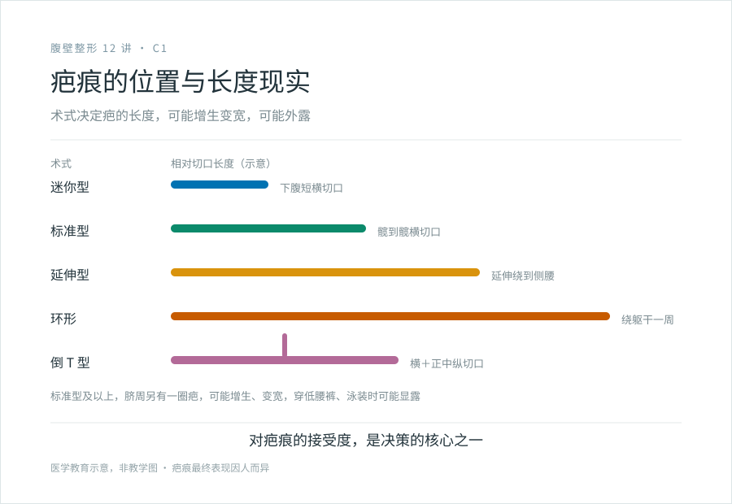
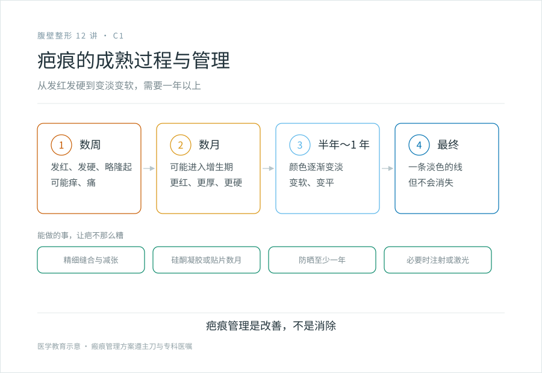

# 关于疤痕，没有温柔的说法

## 三个备选标题

1. 腹壁成形必然留疤：能接受再谈做不做
2. 那条从髋到髋的疤：腹壁成形术的疤痕现实
3. “腹壁成形不留疤”这种话，不诚实

## 封面介绍（100 字以内）

腹壁成形术必然留下下腹部横行疤痕，标准型从髋到髋，可能增生、变宽，穿低腰裤或泳装时显露。脐周也有疤。疤痕成熟要一年以上。对疤痕的接受度是决策的核心之一。

## 分级标识

**手术分级：科普说明**（疤痕管理；腹壁成形术本身属四级，以机构核准为准）

## 正文

先说结论：**腹壁成形术必然留下可见的疤痕，这是这个手术无法回避的代价。**标准型会在下腹留下一条横行疤痕，从一侧髋骨到另一侧；脐周也有一圈疤。这些疤可能增生、变宽、发红，穿低腰裤或泳装时可能露出来。任何告诉你“腹壁成形不留疤”“无痕腹壁成形”的，都不诚实。如果你完全不能接受这条疤，这个手术可能不适合你。

这一篇把疤痕这件事说透，因为它是决策里最该诚实面对的部分。

### 疤会长在哪里

取决于术式（见 B1）：

- **迷你型**：下腹一条较短的横疤。
- **标准型**：下腹横疤，从髋到髋，十几到二十几厘米。
- **延伸型**：横疤继续向两侧延伸到侧腰。
- **环形**：绕躯干一周的疤。
- **倒 T 型**：横疤 + 前腹正中一条纵疤。
- **所有标准型及以上**：脐周还有一圈疤。

医生会把横切口尽量设计在比基尼线能遮住的位置，但：

- 松弛严重时，切口不得不往上设计，超出比基尼线。
- 延伸型、环形、倒 T 型的疤痕，比基尼线根本遮不住。
- 脐周的疤无法藏。

**“藏在比基尼线内”是相对的，不是绝对的。**穿内裤、低腰裤、比基尼时可能露出两端；穿高腰内衣能遮，但那是衣服的选择，不是你的身体。

### 疤会经历什么

疤痕不是缝完就定型的，它有一个长达一年以上的演变过程：

- **早期（数周）**：发红、发硬、略高出皮肤，可能痒、痛。
- **增生期（数月）**：部分人会进入增生性疤痕，疤更红更厚更硬。
- **成熟期（半年到一年，甚至更长）**：颜色逐渐变淡、变软、变平，但不会消失。

最终的颜色和宽度因人而异，取决于个人体质、缝合技术、张力、术后护理、是否感染或愈合不良。**同样一个医生做同样一个术式，不同的人疤痕结果可能差很多。**

### 几种“麻烦”的疤

- **疤痕变宽**：腹壁张力大，疤痕在愈合中被拉宽，是这个手术常见的现实。变宽的疤更明显，更难看。
- **增生性疤痕 / 疤痕疙瘩**：少数体质的人疤痕持续增生，红、厚、硬、痒，超出原始切口范围（疙瘩）或局限在切口范围（增生性）。需要后续瘢痕管理，必要时介入治疗。
- **疤痕色素沉着**：深色皮肤的人疤痕可能长期偏深。

如果你之前做过其他手术或受过伤，可以参考那些疤长得怎么样，作为对自己疤痕倾向的参考。如果你本身就是容易长疙瘩的体质，腹壁成形的疤风险更高，决策前要和医生认真谈。

### 能不能让疤“看不见”

不能。但能尽量让它不那么糟：

- **精细缝合、减张缝合**：医生的缝合技术影响疤痕宽度。
- **术后减张**：使用减张胶带、减张器，减少切口张力，降低变宽。
- **早期瘢痕管理**：拆线后伤口愈合，开始用硅酮凝胶或贴片，持续数月，能改善疤痕的最终外观。
- **避免日晒**：紫外线会加重色素沉着，疤要防晒至少一年。
- **必要的介入**：如果出现增生或疙瘩，可能需要局部注射（如糖皮质激素）、激光等后续治疗。

**这些措施是改善，不是消除。**一个腹壁成形的疤，经过良好管理，能变成一条淡色的线，但它永远在那里。

### 决策前对自己诚实

问自己这几个问题，不要骗自己：

- 我能不能接受下腹有一条横疤，可能十几二十厘米？
- 我平时穿什么衣服？低腰裤、比基尼、露脐装对我来说重要吗？
- 如果疤变宽、变红、增生，我能不能接受？
- 我之前其他伤口的疤长成什么样？
- 我做这个手术，是为自己，还是为了在某种场合（比如海边、亲密关系）展示身体？如果是后者，疤痕会不会反过来成为新的困扰？

**对疤痕的接受度是腹壁成形决策的核心之一。**这不是吓你，是诚实。一个负责任的医生会在面诊时主动和你谈疤痕，而不是回避。如果一个机构对疤痕只字不提，或承诺“无痕”，要警惕。

### 关于“疤痕修复手术”

已经做了腹壁成形、对疤痕不满意的人，有时会考虑疤痕修复（切除重缝、激光等）。但：

- 疤痕修复的效果有限，尤其是已经变宽的疤，重缝后仍可能再变宽。
- 腹壁张力不解决，疤痕修复的改善有限。
- 修复常比初次更难。

**最好的疤痕管理，是在第一次手术前就把疤痕的现实纳入决策。**

> 本文用于健康教育，不能替代面诊和个体化评估；疤痕的最终表现因人而异，术前请与主刀医生充分沟通预期。

## 参考资料

- American Society of Plastic Surgeons: Tummy tuck scars & recovery
  https://www.plasticsurgery.org/cosmetic-procedures/tummy-tuck
- American Board of Cosmetic Surgery: Tummy tuck recovery and scarring
  https://www.americanboardcosmeticsurgery.org/
- 中华医学会整形外科学分会：瘢痕诊疗相关共识（以现行版本为准）
  https://www.cma.org.cn/
