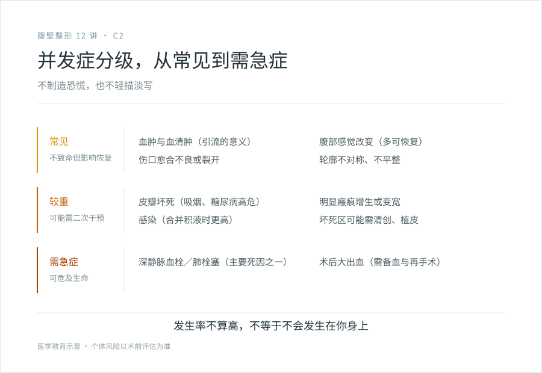
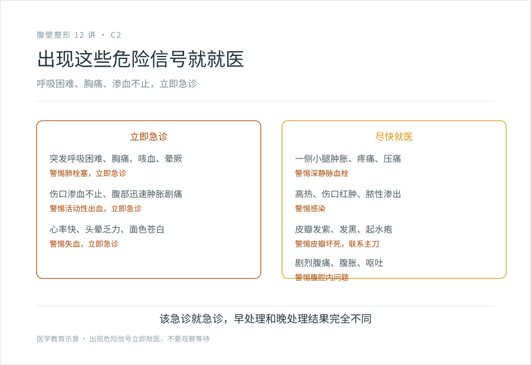

# 血肿、皮瓣坏死、血栓：腹壁成形那些必须正视的风险

## 三个备选标题

1. 腹壁成形术的风险清单：按常见、严重、需急症分级讲清
2. 这个手术最该担心的几件事：皮瓣坏死和血栓
3. 不制造恐慌也不轻描淡写：腹壁成形的并发症现实

## 封面介绍（100 字以内）

腹壁成形术的并发症包括血肿、皮瓣坏死、血清肿、感染、深静脉血栓与肺栓塞、感觉改变、不对称。其中血栓是需严肃对待的严重并发症，规范预防是机构能力的体现。

## 分级标识

**手术分级：四级**（腹壁成形术并发症科普，以机构核准为准）

## 正文

先说结论：**腹壁成形术是四级手术，并发症不罕见。**这篇文章不是为了吓退你，而是让你在决策前知道可能会遇到什么。常见的有血肿、血清肿、伤口愈合不良；较重的有皮瓣坏死、感染；最该严肃对待的是深静脉血栓和肺栓塞，它们是可以致命的。把这些讲清楚，是风险沟通的本分；不提这些就让你手术的，反而要警惕。

下面按“常见 / 较重 / 需急症”分级讲，让你心里有个轻重。

### 常见：不致命但影响恢复

#### 血肿与血清肿

腹部皮瓣下面剥离面大，术后会渗血、渗液。渗血聚集形成血肿，浆液聚集形成血清肿。

小的血清肿很常见，多数能自行吸收。大的或血肿可能需要穿刺抽液、甚至再次手术处理。这就是术后要留置引流管的原因——把积液引出来，减少这类问题。

#### 伤口愈合不良与裂开

切口张力大、皮瓣远端血供差时，伤口可能延迟愈合、部分裂开、皮肤边缘发黑脱落。这种情况下需要长期换药，甚至二次缝合或植皮。吸烟者、糖尿病者、肥胖者风险更高。

#### 感觉改变

腹部皮肤的感觉可能改变，麻木、过敏或感觉减退。多数是暂时的，数月到一年逐渐恢复，但部分人长期有感觉改变。这是皮瓣神经被切断的后果。

#### 轮廓不平整、不对称

脂肪分布不均、皮瓣拉拢张力不一、吸脂不均，可能导致腹部轮廓不平、左右不对称。轻的不影响，明显的可能需要修整。

### 较重：可能需要二次干预

#### 皮瓣坏死

这是腹壁成形最特征性的并发症。皮瓣被掀起后血供改变，远端（下缘中央区）可能缺血坏死，皮肤发紫、发黑、脱落。坏死的范围从小片到大片不等，小片需要长期换药等其自行愈合，大片可能需要清创、植皮或皮瓣转移修复。

**高危因素**：吸烟（显著升高）、糖尿病、肥胖、联合大量吸脂、切口张力过大、既往腹部手术疤痕影响血供。

皮瓣坏死是为什么医生反复强调术前戒烟的原因。一个还在抽烟的人做腹壁成形，皮瓣坏死的风险高得让负责任的医生不愿意做。

#### 感染

任何手术都有感染风险，腹部皮瓣下死腔大、积液多时风险更高。严重感染可能需要抗生素、清创、甚至取出植入物（如果有的话）。合并血清肿或血肿时感染风险上升。

#### 明显的瘢痕增生

部分人疤痕超出预期地增生、变宽、形成疙瘩（见 C1）。这不是单纯的“不好看”，而是需要后续瘢痕管理的并发症。

### 需急症：最该严肃对待的

#### 深静脉血栓（DVT）与肺栓塞（PE）

**这是腹壁成形术最需要警惕的严重并发症，可以致命。**

腹部大手术后，加上术后一段时间活动受限、可能的高凝状态，下肢深静脉可能形成血栓。血栓一旦脱落，随血流到肺动脉，造成肺栓塞，表现为突发胸痛、呼吸困难、咳血、晕厥，可能危及生命。

**肺栓塞虽然发生率不高，但一旦发生后果严重，是腹壁成形术死亡的主要原因之一。**这就是为什么这个手术的血栓预防被反复强调：

- **早期活动**：术后尽早下床（在医生允许范围内），避免长期卧床。
- **机械预防**：弹力袜、间歇充气加压装置。
- **药物预防**：必要时使用抗凝药物（由医生评估出血与血栓的平衡）。
- **缩短手术与制动时间**：合理控制手术时长。

**一个规范的机构会把血栓预防作为围术期的常规，而不是等出事再说。**面诊时你应该问清楚机构的血栓预防方案（见 D2），这是判断机构是否规范的重要指标之一。

#### 出血与大出血

腹部皮瓣血供丰富，术中和术后可能出血。术后大出血表现为伤口迅速肿胀、剧痛、皮肤淤紫扩展、心率加快、面色苍白，需要紧急处理，可能需要再次手术止血和输血。**这就是这个手术要求机构具备血库支持的原因。**

#### 腹壁疝、腹腔内容物损伤

罕见但严重。过度收紧肌层或操作不当可能影响腹壁结构，极罕见情况下可能伤及腹腔内容物。需要外科处理。

### 哪些是危险信号，要马上就医

术后出现以下情况，立即联系医生或急诊：

- 突发呼吸困难、胸痛、咳血、晕厥，警惕肺栓塞，**立即急诊**。
- 一侧小腿肿胀、疼痛、压痛，警惕深静脉血栓，尽快就医。
- 伤口持续渗血、腹部迅速肿胀剧痛、心率快、头晕乏力，警惕活动性出血，**立即就医**。
- 高热（38.5℃ 以上）、伤口红肿热痛加剧、脓性渗出，警惕感染。
- 皮瓣大面积发紫、发黑、起水疱，警惕皮瓣坏死，联系主刀。
- 剧烈腹痛、腹胀、呕吐，警惕腹腔内问题。

**这些信号不要“再观察一下”，该急诊就急诊。**腹壁成形术后的严重并发症，早处理和晚处理的结果可能完全不同。详细的术后危险信号识别，见四级手术系列第 27 篇。

### 怎么降低风险

- **选对机构和医生**：四级手术资质、麻醉能力、血库、监护、血栓预防流程，缺一不可。
- **术前戒烟**：至少术前 4～6 周戒，显著降低皮瓣坏死和愈合不良风险。这是你能做的最重要的事之一。
- **控制基础病**：糖尿病、高血压、凝血问题术前要调控稳定。
- **如实告知病史和用药**：阿司匹林、避孕药、激素等影响凝血或血栓风险的药物，术前要告知医生，按医嘱停用或调整。
- **术后配合**：早期活动（在允许范围）、坚持穿戴弹力衣物、按时复查、出现信号及时就医。

### 关于“风险很低”这种说法

统计上，腹壁成形术的严重并发症发生率不算高，但“不算高”不等于“不会发生在你身上”。**决策前要做的是接受这个概率存在，并确认万一发生，机构和医生有能力处理。**回避谈风险的机构，恰恰是出事时最没准备的。

> 本文用于健康教育，不能替代面诊和个体化风险评估；腹壁成形术属四级手术，须在有相应资质（含血库、麻醉、监护、绿色通道）的医疗机构开展。

## 参考资料

- American Society of Plastic Surgeons: Tummy tuck risks & safety
  https://www.plasticsurgery.org/cosmetic-procedures/tummy-tuck
- American Board of Cosmetic Surgery: Tummy tuck risks
  https://www.americanboardcosmeticsurgery.org/
- 中华医学会整形外科学分会、麻醉学分会：围术期安全管理与 VTE 预防相关共识（以现行版本为准）
  https://www.cma.org.cn/
