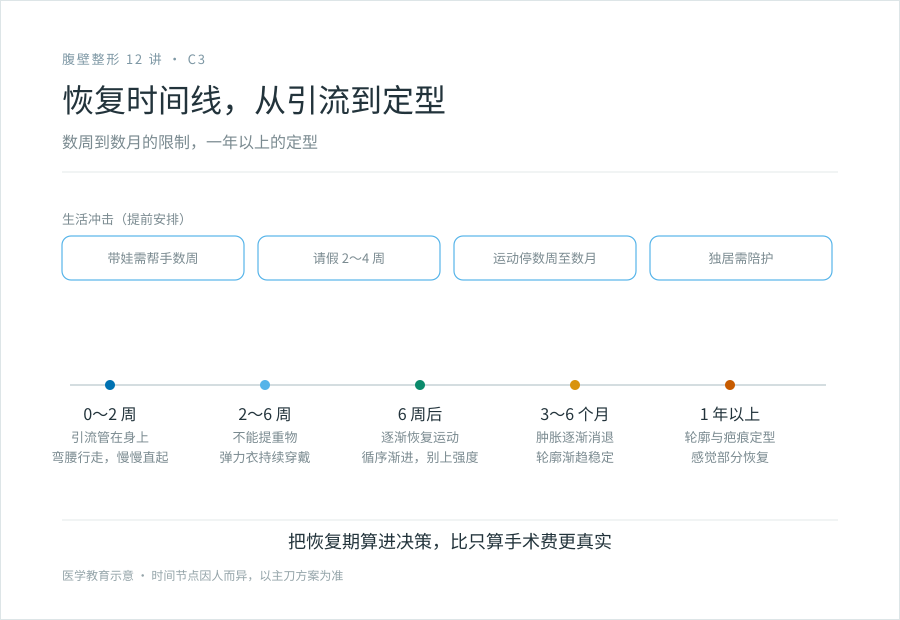
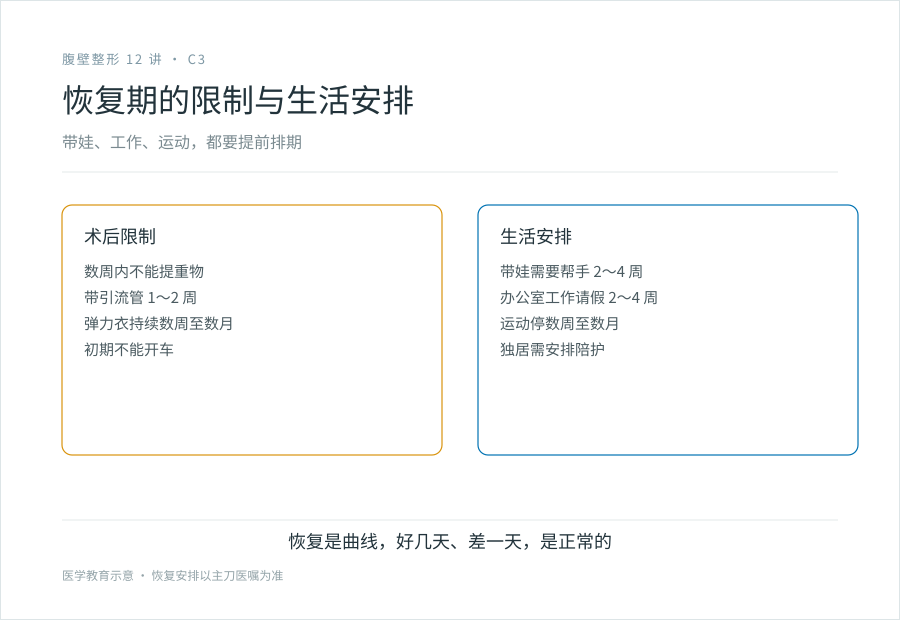

# 带引流、弯腰走、一年才定型：腹壁成形的恢复期长什么样

## 三个备选标题

1. 腹壁成形术后会经历什么：一份诚实的恢复时间线
2. 引流管、弯腰行走、半年消肿：别信“几天就上班”
3. 手术台上结束只是开始：腹壁成形的真实恢复周期

## 封面介绍（100 字以内）

腹壁成形术恢复期长：带引流管 1 到 2 周、弯腰行走期、数周才能直立、数月消肿、疤痕成熟要一年以上。它对带娃、工作、运动的安排都有影响。别信几天就能正常生活的话。

## 分级标识

**手术分级：科普说明**（术后恢复；腹壁成形术本身属四级，以机构核准为准）

## 正文

先说结论：**腹壁成形术的恢复期，是你要认真计入生活安排的成本。**术后要带几天到一两周的引流管，前几天要弯着腰走路（hip-flexed gait），几周才能完全直立，数周到数月才能恢复日常活动，疤痕完全成熟要一年以上。这不是“做完几天就能上班”的项目。如果你有孩子要抱、有工作要兼顾、有运动习惯舍不得停，恢复期对你生活的冲击，要提前想清楚。

### 术后早期（0～2 周）：最难的一段

术日当天和之后几天，你在医院：

- **生命体征监护**：监测心率、血压、体温、血氧。
- **引流管在身上**：皮下留置一根或数根引流管，接引流瓶或球，记录每日引流量。带着管子活动不便，但必要——它把积液引出来，减少血清肿和血肿。通常引流量减少到一定标准后（一般每日少于 30～50 毫升，持续 1～2 天）才拔管，平均 1～2 周，个别人更久。
- **弯腰行走**：因为腹壁皮肤被拉紧，直立会扯着切口剧痛，术后早期你需要弯着腰走路，慢慢一点一点直起来。这个阶段常常持续 1～2 周。
- **疼痛管理**：口服或镇痛泵止痛。
- **穿弹力衣 / 腹带**：持续穿戴，帮助皮瓣贴附、减少积液、塑形。
- **限制活动**：不能提重物、不能剧烈活动、不能完全直立、不能开车。

**这是恢复期最不舒服、最不方便的阶段。**有人形容“像带着一个随身挂件（引流瓶），弯着腰慢慢挪”。如果你要带娃、要做饭、要上班，这段时间几乎需要有人帮忙。

### 中期（2～6 周）：慢慢恢复，但仍有限制

引流管拔了，疼痛减轻，能直立了，但远未恢复：

- **逐渐增加活动量**：散步可以，但仍不能提重物、不能剧烈运动。
- **弹力衣持续穿戴**：通常要求持续穿戴数周甚至数月（具体遵医嘱）。
- **开始轻柔日常**：办公室工作可能 2～4 周后恢复，体力工作更久。
- **开车**：通常要等能自如活动、反应恢复后（一般 2～4 周后，遵医嘱）。
- **肿胀持续**：腹部仍有肿胀，尤其活动一天后。完全消肿要数月。
- **疤痕开始变化**：发红、发硬、可能痒（见 C1）。

### 后期（6 周～数月）：接近正常

- **运动逐渐恢复**：6 周后在医生允许下恢复核心训练、运动，但仍要循序渐进，避免一开始就上高强度。
- **肿胀进一步消退**：3～6 个月腹部轮廓逐渐稳定，但最终形态可能要到半年到一年才定型。
- **疤痕继续演变**：从红硬慢慢变淡变软，过程一年以上。
- **感觉部分恢复**：腹部麻木逐渐改善，部分人长期有感觉改变。

### 完全稳定：一年以上

- 腹部轮廓最终形态、疤痕最终外观、感觉恢复的最终程度，通常要一年以上才能下结论。
- 疤痕完全成熟可能 12～18 个月。

### 恢复期对生活的冲击

这是决策前最该算的账，不只是钱：

- **带娃的人**：术后至少 2～4 周不能抱孩子（不能提重物），需要有人帮忙带孩子。这对新手妈妈是个现实难题。
- **上班族**：办公室工作请假 2～4 周，体力工作更久。
- **运动爱好者**：核心训练、跑步、力量训练要停数周到数月，恢复后循序渐进。
- **独居者**：术后早期连穿衣服、洗澡、做饭都需要协助，独居风险高，建议有人陪护。

**把这些算进决策，比只算手术费用更真实。**

### 关于“几天就能正常”

有些宣传说“微创腹壁成形”“几天就能上班”。对标准腹壁成形术，这不现实。迷你型恢复相对快，但仍然是有引流、有限制的外科手术恢复。**把恢复期说得过短，是在误导，不是在帮你。**

### 几个恢复期的实用建议

- **术前准备**：把家里要用的东西放在伸手能拿到的高度（不用弯腰），准备好宽松前扣的衣服（不用套头）、靠枕、防滑鞋。
- **安排陪护**：术后前几天有人陪，尤其是带孩子、做饭、跑腿。
- **遵医嘱**：引流管什么时候拔、弹力衣穿多久、什么时候能运动，都听你的主刀医生，不要照搬别人的时间表。
- **记录引流量**：每天记引流瓶里的量，复查时给医生看。
- **接受恢复是曲线**：好几天、差一天，是正常的。不是直线变好。

> 本文用于健康教育，不能替代面诊和术后随访；具体的恢复时间节点因人而异，以主刀医生的方案为准。

## 参考资料

- American Society of Plastic Surgeons: Tummy tuck recovery
  https://www.plasticsurgery.org/cosmetic-procedures/tummy-tuck
- American Board of Cosmetic Surgery: Tummy tuck recovery timeline
  https://www.americanboardcosmeticsurgery.org/
- 中华医学会整形外科学分会：腹壁成形术围术期管理相关资料（以现行版本为准）
  https://www.cma.org.cn/
