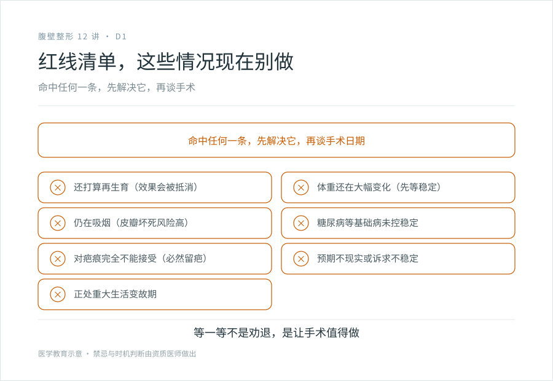
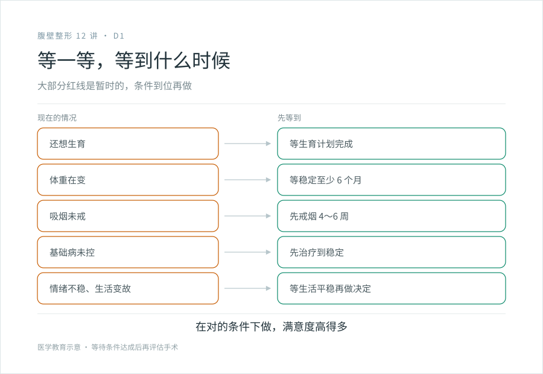

# 这些情况现在别做：腹壁成形的禁忌与“等一等”

## 三个备选标题

1. 还想生、没戒烟、体重在掉：这些情况现在别做腹壁成形
2. 腹壁成形的红线清单：哪些情况要等一等
3. “现在不是时候”比勉强手术更负责任

## 封面介绍（100 字以内）

还想再生育、体重未稳定、未戒烟、未控的糖尿病或心肺病、对疤痕完全不能接受——这些情况现在不适合做腹壁成形。等一等不是劝退，是降低不可逆后悔。

## 分级标识

**手术分级：科普说明**（禁忌与手术时机判断；腹壁成形术本身属四级，以机构核准为准）

## 正文

先说结论：**有些情况，现在做腹壁成形是个错误决定。**不是说永远不能做，是现在不该做。还想再生育的，做了会被下一次妊娠抵消；体重还在掉的，做了皮肤又会松；还在抽烟的，皮瓣坏死的风险高得让负责任的医生不愿意接；对疤痕完全不能接受的，这个手术必然留疤，做了大概率后悔。把“等一等”当成劝退，是误解——等一等是为了让手术值得做、做了不后悔。下面是几条清晰的红线。

### 红线一：还打算再生育

**腹壁成形术收紧了腹直肌、切除了多余皮肤。如果之后再怀孕，子宫再次膨大，会把收紧的肌层重新撑开，皮肤也会再次被拉伸。**等于这次手术的效果被下一次妊娠抵消了大半。

建议：生育计划基本完成后再做。这不是绝对禁忌（有人做了之后再孕，也能正常妊娠），但效果会打折。如果你明确还想要孩子，现在不是时候。

### 红线二：体重还在大幅变化中

**体重还在下降时做手术，瘦下去后皮肤又松，等于白切。**体重还在上升时做，脂肪堆积会改变轮廓，也影响效果。

建议：体重稳定至少 6 个月（很多中心要求 12 个月）再考虑。减重手术（胃旁路、袖状胃等）后的朋友，通常建议体重稳定 1～2 年（见 A3）。把手术留给体重已经稳住的阶段。

### 红线三：还在抽烟

**吸烟显著升高腹壁成形的皮瓣坏死、伤口愈合不良、感染风险。**尼古丁收缩血管，破坏皮瓣的微循环，而腹壁成形恰恰需要皮瓣有良好血供。

这不是“抽少点没关系”——活跃吸烟者的并发症风险显著高于非吸烟者。负责任的医生会要求术前至少戒烟 4～6 周（有些要求更久），且术后一段时间内不复吸。

建议：如果你做不到术前术后一段时间戒烟，现在不是做这个手术的时候。先戒烟，再谈手术。

### 红线四：未控制的基础病

以下情况未稳定前，手术风险显著升高：

- **糖尿病**：血糖未控制好，伤口愈合不良和感染风险高。术前要把血糖调控到稳定。
- **凝血异常**：出血或血栓风险升高，术前要评估和调整。
- **严重心肺疾病**：全身麻醉和腹部大手术对心肺是考验，严重心肺功能不全者可能不适合。
- **免疫抑制状态**：影响愈合和感染风险。

建议：先和内科医生把这些控制稳定，再评估手术。

### 红线五：对疤痕完全不能接受

**腹壁成形术必然留下可见疤痕（见 C1）。**如果你完全不能接受下腹一条横疤、不能接受穿低腰裤或泳装时可能露出、不能接受疤可能变宽或增生，这个手术几乎注定让你后悔。

这不是医生态度的问题，是这个手术的物理后果。对疤痕的接受度，和身体状况一样是适应证的一部分。

建议：如果你对疤痕高度敏感，先认真看完 C1，和医生谈疤痕预期。谈完还是不能接受，那么这个手术现在不适合你，或者你需要的是不切皮的方案（但那样的方案解决不了皮肤过剩）。

### 红线六：预期不现实

- 期待“换个人生”“彻底平坦如少女”“不留痕迹”，这些预期手术都达不到。
- 把手术当成解决婚姻、自信、人生困境的手段。手术改变身体结构，改变不了这些。
- 短期内频繁更换“想做的项目”，诉求不稳定时，重大不可逆决定不宜做。

建议：把预期校准到“改善具体的腹部问题”，再决定。预期管理的详细内容，见四级手术系列第 5 篇《决策与心理预期》。

### 红线七：正处于重大生活变故

分手、失业、丧亲、严重冲突期间，情绪不稳定时做的不可逆决定，事后后悔率高。这不是道德判断，是统计规律。重大不可逆手术不宜在最脆弱的时候定。

建议：等生活稳定下来，再做这个决定。

### “等一等”不是“永远别做”

把这些红线列出来，不是劝你不做，是帮你在对的时机做。很多“现在不能做”的情况，是暂时的：

- 想再生的，等生育完成。
- 体重没稳的，等稳了再做。
- 抽烟的，先把烟戒了。
- 基础病没控的，先控好。
- 情绪不稳的，等稳定了。

**在对的条件下做这个手术，效果和满意度都高得多。**勉强在不合适的时机做，风险翻倍、效果打折、后悔概率高。学会说“现在不是时候”，是负责任决策的一部分。

### 一个简单的自检

面诊前，对着这七条红线过一遍。如果有任何一条命中，先解决那条，而不是急着定手术日期。把这些状态调好，本身就是为手术做准备。

> 本文用于健康教育，不能替代面诊和个体化评估；手术适应证与禁忌的最终判断，由有相应资质的医师做出。

## 参考资料

- American Society of Plastic Surgeons: Tummy tuck candidates & safety
  https://www.plasticsurgery.org/cosmetic-procedures/tummy-tuck
- American Board of Cosmetic Surgery: Tummy tuck candidates
  https://www.americanboardcosmeticsurgery.org/
- 中华医学会整形外科学分会：腹壁成形术围术期评估相关资料（以现行版本为准）
  https://www.cma.org.cn/
