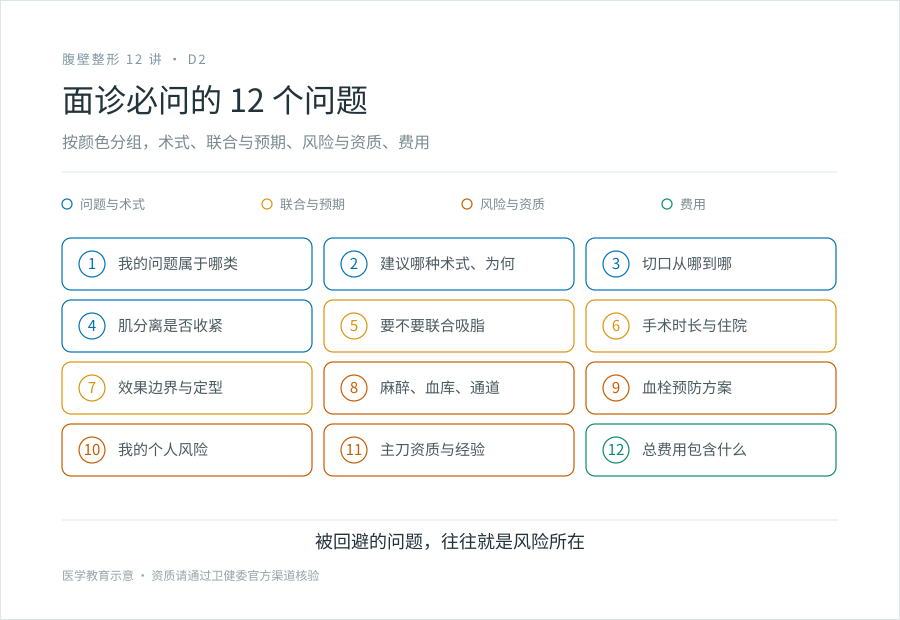
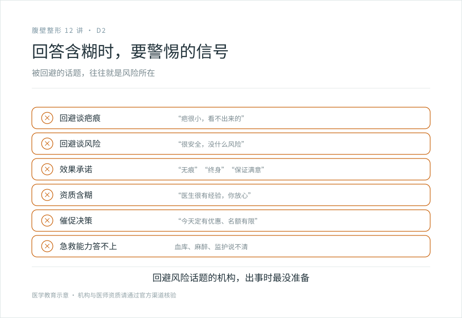

# 面诊腹壁成形术：一份可以直接带走的必问清单

## 三个备选标题

1. 面诊腹壁成形该问什么：12 个问题别漏了
2. 切口在哪、能不能联合、有没有血库：面诊腹壁成形的硬问题
3. 回答含糊时要警惕：面诊腹壁成形的信号识别

## 封面介绍（100 字以内）

面诊腹壁成形术要问清术式与切口、是否联合吸脂、疤痕预期、机构的麻醉与血库与血栓预防、主刀的四级权限。回答含糊或回避风险的，要警惕。

## 分级标识

**手术分级：科普说明**（面诊沟通清单；腹壁成形术本身属四级，以机构核准为准）

## 正文

先说结论：**面诊不是听销售介绍，是你收集决策信息的关键环节。**腹壁成形是四级手术，你要在面诊里搞清楚：我的问题属于哪一类、建议哪种术式、切口在哪、疤长什么样、要不要联合吸脂、风险怎么预防、机构有没有能力兜底、主刀有没有权限做。下面这份清单可以直接带去面诊，一项一项问清楚，并留意哪些回答含糊、哪些问题被回避——那些往往是风险所在。

通用面诊框架见四级手术系列第 3 篇《面诊要问什么》，这一篇专门针对腹壁成形。

### 第一组：我的问题和术式（4 问）

**1. 我的问题主要属于哪一类？**

让医生做体格检查后告诉你：主要是脂肪、皮肤松弛、腹直肌分离、还是腹壁疝，或哪几种叠加。这是所有后续方案的基础。

**2. 建议我做什么术式？为什么？**

迷你型、标准型、延伸型、环形、倒 T 型？为什么是这一种？它对应我的松弛范围在哪里？（见 B1）

**3. 切口具体从哪到哪？穿什么衣服会露出？**

让医生在体表比划或标记切口走向。问清楚穿内裤、低腰裤、泳装时疤会不会露出。这是疤痕现实的第一手信息（见 C1）。

**4. 我的腹直肌分离需不需要收紧？怎么收紧？**

如果是产后或分离明显，确认手术方案含不含肌层收紧（折叠缝合）。这是腹壁成形区别于单纯切皮的核心。

### 第二组：联合手术与预期（3 问）

**5. 我需不需要联合吸脂？在哪些区域抽？大概多少？**

评估脂肪量后，医生会判断要不要联合（见 B3）。问清楚抽哪些区域、大概抽多少、联合会增加哪些风险。

**6. 手术大概多长时间？住院几天？**

时长和住院反映手术复杂度和你的恢复成本。

**7. 效果的边界是什么？最终多久定型？**

确认预期：腹部会更平更紧，但疤会有、不对称会有、完全定型要半年到一年。把预期校准到现实（见 C3）。

### 第三组：风险与围术期（3 问）

这一组最重要，是判断机构是否规范的试金石。

**8. 机构的麻醉能力、血库、ICU 或绿色通道怎么样？**

四级手术要求全身麻醉、备血、术后监护、危急情况有绿色通道。问清楚机构有没有自己的血库（或可靠的用血保障）、麻醉团队、ICU 或转诊绿色通道。**含糊或回避这个问题的，要警惕。**

**9. 血栓怎么预防？**

深静脉血栓和肺栓塞是腹壁成形最该严肃对待的并发症（见 C2）。问机构用不用弹力袜、间歇充气加压、术后早期活动、必要时抗凝。**如果机构对血栓预防没有明确方案，这是大问题。**

**10. 我的个人风险高不高？需要术前做什么准备？**

吸烟、糖尿病、肥胖、既往腹部手术、用药史（避孕药、阿司匹林等）都会影响风险。问清楚你的高危因素、术前要戒烟多久、哪些药要停。

### 第四组：主刀与资质（1 问，但很硬）

**11. 主刀医生的资质和经验？有四级手术权限吗？**

- 医师执业资质可以在国家卫健委官网查询，看执业范围、执业地点。
- 四级手术权限是批给机构还是医生，各地口径不同，但主刀必须有相应权限和经验。
- 问主刀做过多少例腹壁成形、有没有处理并发症的经验。

**回避谈资质、含糊带过经验的，不要选。**

### 第五组：费用与术后（1 问，串起来）

**12. 总费用包含哪些？术后复查、弹力衣、可能的并发症处理在不在内？**

费用构成的逻辑见 D3。这里要问清楚报价包含什么、不包含什么，避免术后才发现还有额外支出。

### 回答含糊时要警惕的信号

面诊时，留意这些信号，它们往往是风险的提示：

- **回避谈疤痕**：“疤很小，看不出来的。”不诚实。负责任的医生会主动、具体地谈疤痕。
- **回避谈风险**：“这手术很安全，没什么风险。”没有手术没风险。不谈 DVT、皮瓣坏死的，要警惕。
- **承诺“无痕”“终身”“满意”**，这些是效果承诺，违反合规底线。
- **资质含糊**：“医生很有经验，你放心。”拿不出具体资质和数据的，别信。
- **催促决策**：“今天定有优惠，名额有限。”重大不可逆决策不该被时间压力推动。
- **机构的血库、麻醉、监护答不上来**。四级手术出事时靠这些救命，答不上来的机构不具备兜底能力。
- **主刀不是同一个人**：面诊时一个医生，手术时换另一个。问清楚谁主刀，确认主刀的资质。

### 几个面诊的实用建议

- **多面诊几家**：至少 2～3 家有四级资质的机构，对比术式建议、风险沟通、费用构成。不同医生的建议差异本身就是信息。
- **带着清单去**：把上面 12 个问题打印或写在手机里，一项一项问，当场记答案。
- **要求看主刀的真实案例**：不是网图，是主刀自己做的、有授权的案例（注意，案例是别人的解剖，不能直接套到自己）。
- **别在第一次面诊就定手术**：回去消化信息，对比几家，再决定。
- **带信任的人一起去**：多一双耳朵，也能在你情绪化时帮你把持。

> 本文用于健康教育，不能替代面诊和个体化评估；机构与医师资质请通过官方渠道核验。

## 参考资料

- American Society of Plastic Surgeons: Tummy tuck consultation
  https://www.plasticsurgery.org/cosmetic-procedures/tummy-tuck
- 国家卫健委：医师执业注册信息查询
  https://www.nhc.gov.cn/
- 中华医学会整形外科学分会：四级手术资质与围术期管理相关资料（以现行版本为准）
  https://www.cma.org.cn/
