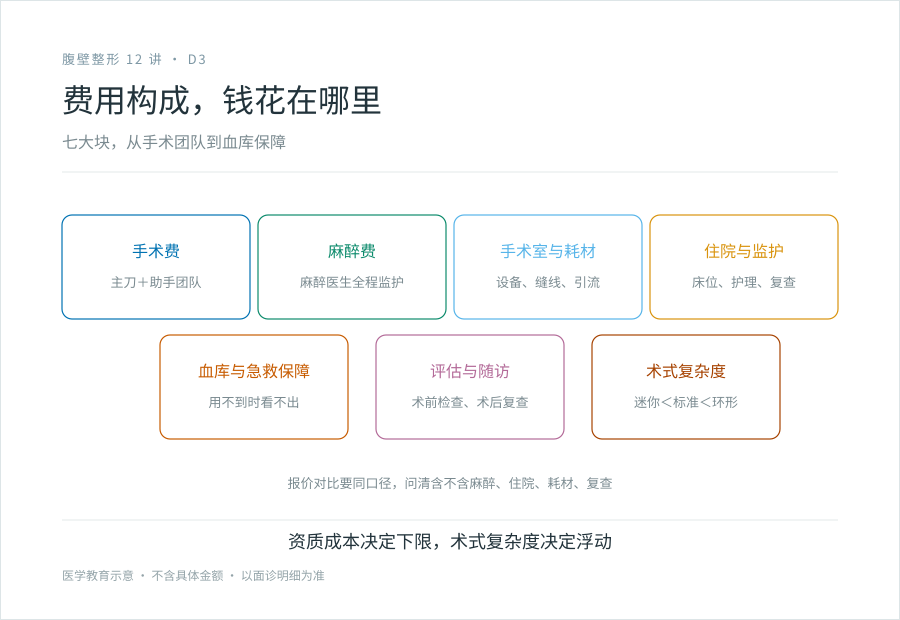
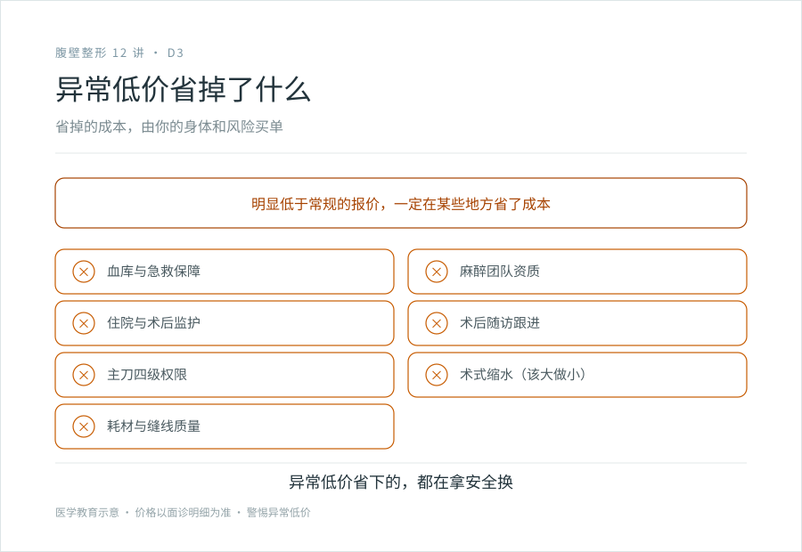

# 腹壁成形为什么这么贵，又为什么差价那么大

## 三个备选标题

1. 腹壁成形的费用构成：钱花在哪里，为什么差价大
2. 异常低价省掉了什么：读懂腹壁成形的价格逻辑
3. 四级手术资质是成本底线：腹壁成形定价的真相

## 封面介绍（100 字以内）

腹壁成形的费用由四级手术资质成本（硬件、团队、麻醉、住院、血库）决定下限，术式复杂度和是否联合吸脂决定浮动。异常低价往往省掉了血库、团队或随访。读懂价格逻辑，识别风险。

## 分级标识

**手术分级：科普说明**（费用逻辑科普；腹壁成形术本身属四级，以机构核准为准）

## 正文

先说结论：**腹壁成形术的费用，由“四级手术资质成本”决定下限，由术式复杂度决定浮动。**这是一台需要全身麻醉、住院、备血、术后监护、团队协作的大手术，它的成本里有一大块是“能安全做下来、出事能兜底”的硬件和团队。所以正常价格不会太低——异常低价往往意味着在你看不见的地方省了成本：血库、麻醉团队、监护、随访、甚至主刀资质。这一篇不报具体数字（地区、时效、术式差异太大，报了也不准），讲清楚价格构成的逻辑，帮你判断什么样的报价合理、什么样的报价要警惕。

### 为什么这一篇不写具体价格

腹壁成形的费用受太多变量影响：

- 地区差异（一线城市和三四线差异大）
- 术式（迷你型 vs 环形，差几倍）
- 是否联合吸脂、联合多少
- 机构性质（公立 vs 私立、是否四级资质）
- 时间（物价和汇率变化）

写一个具体数字，要么很快过时，要么对你所在的地区完全没参考价值。**比记住一个数字更重要的，是理解价格背后的构成逻辑。**知道钱花在哪里、为什么有差异，你就能自己判断一份报价是合理还是异常。

### 费用的几大块构成

#### 1. 手术费（主刀 + 助手团队）

主刀医生的资质、经验、四级手术权限，是这一块的核心。有经验的、能处理并发症的主刀，和刚拿到权限的主刀，价格不同。腹壁成形不是一个人能完成的手术，需要助手团队配合，团队的人力成本也在这里。

#### 2. 麻醉费

全身麻醉需要专业的麻醉医生和麻醉设备，全程监护。**麻醉不是“打一针让你睡着”那么简单，它是围术期安全的核心环节。**麻醉团队的资质和配备，是费用的重要组成，也是机构能力的体现。

#### 3. 手术室与耗材

层流手术室、监护设备、缝合材料、引流管、敷料、弹力衣、（联合吸脂时的）吸脂设备与耗材。这些都是硬成本。

#### 4. 住院与监护

腹壁成形需要住院几天。住院费用包含床位、护理、监护、药物、换药、复查。**能把四级手术做规范的机构，背后有完整的住院和监护体系，这部分成本省不掉。**

#### 5. 血库与急救保障

这一块常常被忽略，但很关键。腹壁成形可能出血，需要备血。一个有四级手术资质的机构，要么有自己的血库，要么有可靠的用血保障。还要有危急情况的绿色通道（比如肺栓塞、大出血的应急流程）。**这些“用不到时看不出、用到时救命”的保障，是成本的一部分。**

#### 6. 术前评估与术后随访

术前检查（血常规、凝血、心电图、必要时影像）、术后复查（引流情况、伤口、疤痕）、弹力衣、瘢痕管理指导。规范的机构有完整的随访体系，这部分也计入成本。

#### 7. 术式复杂度的加价

- 迷你型 < 标准型 < 延伸型 < 倒 T 型 / 环形。
- 联合吸脂加价（吸脂量、区域、设备）。
- 复杂修复或联合其他部位手术加价。

**复杂度越高，手术时间越长、耗材越多、风险越高、对团队要求越高，价格自然越高。**

### 为什么差价那么大

同样叫“腹壁成形”，报价能差几倍，原因就在上面这些块的组合不同：

- **资质差异**：有四级资质的机构，硬件和团队成本高，定价反映这些成本；没有四级资质却偷偷做的，省了资质成本，价格低，但风险你扛。
- **术式差异**：迷你型便宜，环形贵。有人拿迷你型的价格吸引你，面诊后告诉你“你这种情况得做标准型”，价格翻倍。
- **是否含住院、麻醉、血库**：有的报价只含手术费，麻醉、住院、耗材另算；有的打包。**对比报价时一定要问清“含什么、不含什么”。**
- **主刀差异**：资深主刀和年轻主刀价格不同。
- **地域差异**：一线和三四线的物价、人力成本不同。

### 异常低价省掉了什么

如果一个报价明显低于市场常规，它一定在某些地方省了成本，而这些地方往往是你看不见、出事时才意识到的：

- **省了血库和急救保障**：平时用不到，出事时没有，后果致命。
- **省了麻醉团队**：用不规范的人员或方式麻醉，风险高。
- **省了住院和监护**：让你术后早早出院，并发症发现晚。
- **省了随访**：术后没人管你，引流、疤痕、伤口问题没人跟进。
- **省了主刀资质**：用没有四级权限的人主刀，或面诊的是 A 手术时是 B。
- **省了术式**：你需要标准型，给你做迷你型，效果打折。
- **省了耗材质量**：缝合材料、引流管、弹力衣用差的，影响愈合和疤痕。

**这些省掉的成本，最终由你的身体和风险来买单。**四级手术省下的每一分钱，都是在拿安全换。

### 对比报价时问清楚的

拿到一份报价，问清楚这些问题：

- 这个价格包含手术费、麻醉费、手术室、住院、耗材、复查吗？还是分开算？
- 住院几天？超出怎么收费？
- 如果需要联合吸脂、或术中发现要升级术式，怎么计价？
- 术后弹力衣、瘢痕管理、复查包不包含？
- 如果出现并发症需要处理，费用怎么算？

**把这些问清楚，把不同机构的报价放在同一口径下对比，才有意义。**只比一个总价，会被“低总价 + 高额外收费”的套路坑。

### 几个关于费用的实话

- **贵不等于好，但异常便宜一定有问题。**四级手术有它的成本底线，低于这个底线的报价，省掉的是安全保障。
- **价格不是选机构的唯一标准，甚至不是最重要的标准。**资质、主刀经验、风险沟通、急救能力，比价格重要得多。在这些基础上再比价格。
- **不要被“优惠”“限时”“名额”推动决策。**重大不可逆手术不该被销售话术催促。
- **费用透明度本身是机构规范程度的信号。**能讲清楚每一块构成的，比一个总价不解释的，更值得信任。

> 本文用于健康教育，不涉及具体报价；费用以面诊后机构提供的明细为准，请通过正规渠道核实机构与医师资质。

## 参考资料

- American Society of Plastic Surgeons: Tummy tuck cost
  https://www.plasticsurgery.org/cosmetic-procedures/tummy-tuck
- 国家卫健委：医疗机构与医师执业资质查询
  https://www.nhc.gov.cn/
- 中华医学会整形外科学分会：医疗美容服务项目管理相关资料（以现行版本为准）
  https://www.cma.org.cn/
